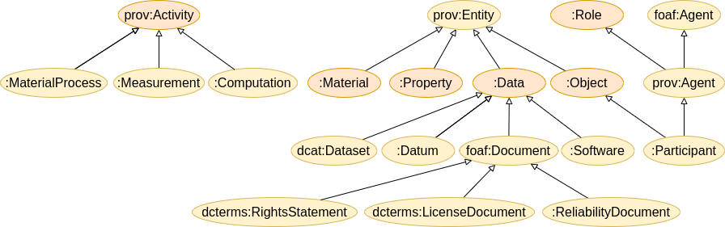
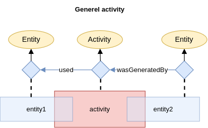
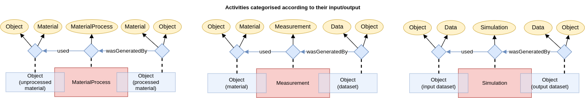
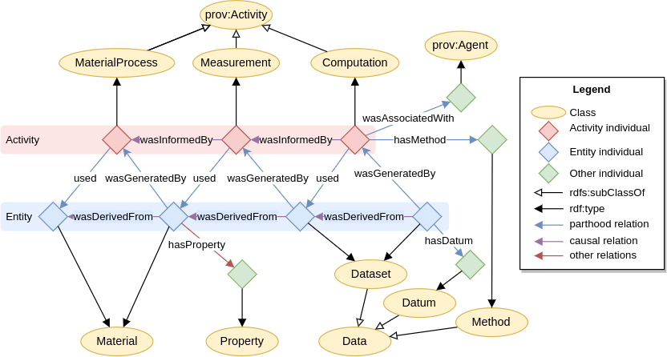
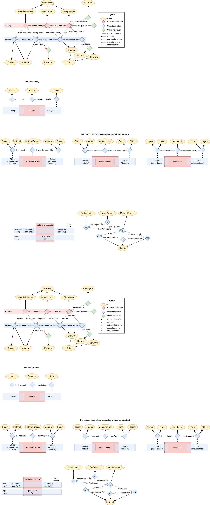
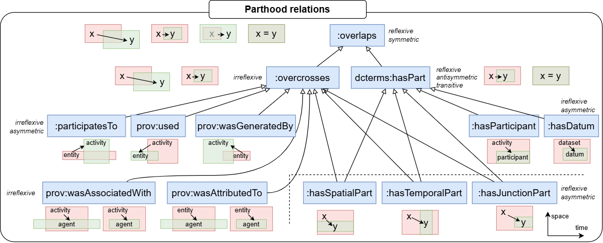
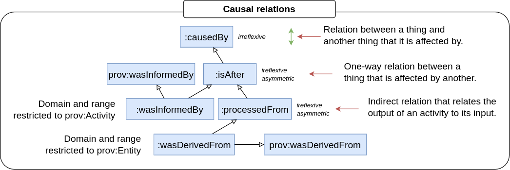
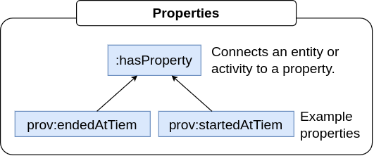
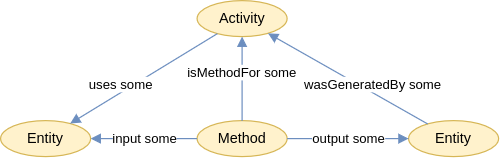

# The PINK Annotation Schema
The PINK Annotation Schema provides semantic annotations for the Safe and Sustainable by Design (SSbD) approach to guide the innovation process for chemicals and materials.
It adhears to the recommendations specified by [DCAT-AP 3.0.1] as implemented in [Tripper],
and builds on [PROV-O] for provenance.
It is constructed to be easily aligned with [EMMO].

> [!WARNING]
> The PINK Annotation Schema is still under early and heavy development and may change without notice.
> It is not intended for production at the current stage.

## Repository Files
- `catalog-v001.xml`: XML catalog mapping ontology files to their IRIs for semantic web tools.
- `contributors.ttl`: Turtle file listing contributors to the PINK Annotation Schema for this repository.
- `pink_annotation_schema.ttl`: Main ontology file for the PINK Annotation Schema.
- `reused-terms.ttl`: Terms from standard vocabularies reused by the schema.
- `LICENSE`: Creative Commons Attribution 4.0 International license.
- `docs/`: Sub-directory with documentation.
- `scripts/`: Sub-directory with scripts for generating keywords file for Tripper.

## Extra PINK annotations of externally defined terms
The PINK Annotation Schema never changes the semantics of existing terms defined externally (e.g. by W3C or DCAT-AP).
However, the PINK Annotation Schema can:
- Make the documentation of externally defined terms explicit in the Knowledge Base (KB) without importing the whole vocabularies.
- Add PINK-specific usage notes (using `pink:usageNote`, not `vann:usageNote`).
- Add a `ddoc:conformance` relation that specifies whether the relation is "mandatory", "recommended" or "optional" in PINK.
  PINK will never change the conformance described in the DCAT-AP documentation to something weaker.

The basic rule for such additions is that they can live hand-in-hand with similar annotations by other projects without creating confusion or inconsistencies.

For any other additional specifications of an existing term, a PINK-specific subclass or subproperty will be created.
Such subclasses/subproperties will normally keep the W3C name, but with the `pink` namespace (or the `ddoc` namespace if the concept is specific for the tripper data documentation).

## Taxonomy
The taxonomy below shows a basic categorisation of the main concepts (OWL classes) in the PINK Annotation Schema.
It unifies concepts from common vocabularies, like [Dublin Core], [DCAT], [PROV-O] and [FOAF].
This gives the adapted terms additional context.
However, the taxonomy is intentionally weekly axiomated in order to facilitate alignment to different popular top-level ontologies, like [EMMO], [DOLCE] and [BFO].

At the top-level, the PINK Annotation Schema has four root concepts:

- **`prov:Entity`**: A physical, digital, conceptual, or other kind of thing with some fixed aspects.
  [PROV-O] lacks the accuracy of nominalism and allows both real and imaginary entities.

- **`prov:Activity`**: Something that occurs over a period of time and acts upon or with entities.
  Hence, its individuals have some temporal parts (that are not of the same type as the activity itself).
  An activity may include consuming, processing, transforming, modifying, relocating, using, or generating entities.

- **`:Role`**: The class of all individuals that are defined through a parthood relation to an entity.
  The individual can be said to have a *role* in relation to the entity.

- **`foaf:Agent`**: A thing that does stuff (like person, group, software or physical artifact).
  The [FOAF] specification of a *agent* is very loose.
  The subclass `prov:Agent` provides further context, by saying that a `prov:agent` bears some form of responsibility for an activity, the existence of an entity or the activity of another agent.

See the [PINK classes] table and the PINK Annotation Schema itself, for a description of all the other concepts.

## Provenance
The provenance description in PINK is based on [PROV-O].

For more accurate descriptions of complex workflows involving spatial and temporal parts, PINK suggests an enhanced formalism.

A textual description of the provenance can be provided with `dcterms:provenance`.
However, for a semantic provenance description [PROV-O] should be used (since `dcterms:provenance` has no agreed semantics as discussed by [DCAT-AP][dcatap-provenance]).

The basic building block of a provenance description is a `prov:Activity` with `prov:Entity` as input and output:

As shown in the taxonomy, this general process can be sub-categorised according to its input and output:

Traceability can be achieved by connecting a series (or network) of these basic building blocks.
<!-- When two or more intentionally planned processes are connected this way, we call it a *workflow*. -->
By providing additional knowledge to the various process steps we get *provenance*.
The figure below shows an example of a simple provenance graph, that combines three processes with some additional annotations.

Concepts belonging to the PINK namespace in the figure above have been written in cursive.

Given the network of `:used` and `:wasInformedBy` relations, it is possible to infer `:wasInformedBy` and `:wasDerivedFrom` relations.
This is done by the reasoner (using [SWRL] rules that are added in [pink_annotation_schema.ttl]).

### Complex workflows with spatial and temporal parts
An important aspect of provenance is to keep track on how a sample e.g. is cut into several specimens and how the specimens later may be joined in new configurations.
Likewise, how a material is changed during a process or part of a process.

The figure below shows a material process (`p`) that changes a material (`m`).
The input and output of the material process are the temporal parts (`m1` and `m2`) of the material, respectively.
The material process is driven by an agent (`a`), who's temporal part (`a1`) is a participant (i.e. has an active role) in the process.

### Enhanced parthood and causal formalism
To formally describe workflows correctly, such as the above material process, the PINK Annotation Schema includes formalised categorisations of parthood and causal relations, shown in the figures below.
These categorisations incorporate parthood and causal relations from [Dublin Core] and [PROV-O] and give them enhanced semantic meaning.
It is based on the mereocausal theory by [Zaccarini *et. al.*], but simplified and adapted to the needs of PINK.

The above figure includes graphical illustrations of the parthood relations.
The colour scheme in these illustrations represents activities in red, entities in blue, agents in green and unspecified nature (activity/entity/agent) in gray.
The arrow illustrates the direction of the relation.

For improved semantic expressiveness and to support logical validation, the PINK Annotation Schema adds characteristics to the standard [PROV-O] object properties.
According to the [rules](#extra-pink-annotations-of-externally-defined-terms) defined above, the characteristics is added to PINK-specific subproperties of the [PROV-O] object properties.
Such semantically enhanced subclass relations of corresponding [PROV-O] and [Dublin Core] relations are written in *cursive* in the figure above.

> [!TIP]
> Object property chracteristics is explained in the [Protégé documentation](https://protegeproject.github.io/protege/views/object-property-characteristics/).
>
> Antisymmetric (not included in OWL) is a weaker form of asymmetric: if `x -> y`, then `y -> x` if and only if `x = y`.
> This is not the case for asymmetric relations, since they exclude the equality `x = y`.

Causal relations focuses on whether an individual is influenced by another.
In [PROV-O] this is described by the fundamental relation `prov:wasInfluencedBy`.
In PINK we introduce the toplevel subclass `:causedBy` as a subclass of `prov:wasInfluencedBy`.
The causal relations currently included in the PINK Annotation Schema are shown in the figure below.
Most of these relations are indirect causations mediated by an activity.
These chains of causations have been expressed using [SWRL] rules.
The relations starting with ":was" are subclasses of the corresponding relations in [PROV-O].
The `:attributed` and `:wasAttributedTo` are the inverse of each other.

### Property relations
The PINK Annotation Schema includes currently one relation that is neither a parthood nor a causal relation.
This is the `:hasProperty` relation that connects an entity or activity to one of its properties (via a [semiotic] process involving an interpreter that assigns the property).
The most important feature of `:hasProperty` is that it adhere to the scientific view that a property is not an intrinsic quality of an entity, but something that is measured or determined by an interpreter.

For example, to determine the toxicity of a chemical substance you have to measure (or calculate or estimate) it. And the result depends on how it is measured.

## General description of methods
Provenance is about what has happened. [PROV-O] is intended to describe provenance information.
In PINK we also want to describe general workflows before they are executed.
That is, to describe something that can happen.

Since we don't know whether the workflow actually will be executed, we can't create individuals for it.
Hence, what can happen must be described at class level (TBox-level).

Another important difference from the provenance description above, is that while provenance places the activity in the centre, PINK places the *method* in the centre when describing something that can happen.
A method is a subclass of data that describes how to perform an activity, like what type of activity will be performed, what type of input it takes, what type of output it produces, is there an API for performing the activity, etc...
A method is therefore also an agent for the activity it describes.
The figure below shows how a method relates to an activity and its input and output.

> [!NOTE]
> Note the use of "some" in the arrows in the above figure.
> It indicates that the arrows do not represent relations between individuals, but existential restrictions between classes.

In Manchester syntax, this may be expressed as follows

    Class: app:MyMethod
        subClassOf: pink:Method
        subClassOf: pink:hasProcess some app:MyActivity
        subClassOf: pink:input some app:MyInput
        subClassOf: pink:output some app:MyOutput

where `app` is the prefix of the application ontology defining the method and its associated activity and input/output and `app:MyActivity`, `app:MyInput`/`app:MyOutput` are subclasses of `prov:Activity` and `prov:entity`, respectively.

PINK provides tooling (based on [Tripper]) to help providing class-level documentation.
This is done the normal way using spreadsheets, but with the `@type` keyword replaced by `subClassOf` (`@type` is implicit and would always be `owl:Class`).
For example, the above declaration of a computation could provided as follows:

| @id          | @type     | subClassOf  | description | hasProcess     | input       | output       |
|--------------|-----------|-------------|-------------|----------------|-------------|--------------|
| app:MyMethod | owl:Class | pink:Method | ...         | app:MyActivity | app:MyInput | app:MyOutput |

where `app:MyInput` and `app:MyOutput` refer to dataset classes.
These dataset classes can be documented in a similar way as the method classes:

| @id          | @type     | subClassOf   | description | ... |
|--------------|-----------|--------------|-------------|-----|
| app:MyInput  | owl:Class | pink:Dataset | ...         | ... |
| app:MyOutput | owl:Class | pink:Dataset | ...         | ... |

# Generating keywords file for Tripper
To generate the keywords file for [Tripper], run the file `scripts/generate_tripper_keywords.py`.

This requires that [Tripper] is installed in your python environment.

A few considerations when running the script:
First and foremost, when the keyowrds are generated from the ontology the argument redefine is set to `allow`.
This means that terms in the PINK Annotation Schema that have the same preflabel as terms already defined in Tripper's default keywords file will overwrite those.
In addition, when turning on logging a few extra notifications are printed.
 - Missing classes, i.e. classes that are not already defined, are added in the Keywords. This happens for `http://www.w3.org/ns/prov#Entity` and `http://www.w3.org/ns/prov#Entity`.
 - `documentation` is redefined from `foaf:page` to `pink:documentation` because pink specified that this is the documentation of a Resource. Note that pink:documentation is a subproperty of foaf:page.
 - `hasPart` is redefined from `dcterms:hasPart` to `pink:hasPart` because hasPar in pink is further refined to be a subproperty of `pink:overlaps`.
 - `conformance` is redefined from `ddoc:conformance` to `pink:conformance` because additional requirements are added in PINK on top of dcat-ap, which is the default in Tripper.
 - `wasGeneratedBy`is redefined from `prov:wasGeneratedBy` to `pink:wasGeneratedBy` because it is further refined in PINK as a subproperty of `prov:wasGeneratedBy`.

# References

[PINK classes]: ./docs/classes.md
[pink_annotation_schema.ttl]: ./pink_annotation_schema.ttl
[Zaccarini *et. al.*]: https://ebooks.iospress.nl/doi/10.3233/FAIA231120
[semiotic]: https://plato.stanford.edu/entries/peirce-semiotics/
[DCAT-AP 3.0.1]: https://semiceu.github.io/DCAT-AP/releases/3.0.1/
[DCAT]: https://www.w3.org/TR/vocab-dcat-3/
[FOAF]: http://xmlns.com/foaf/spec/
[PROV-O]: https://www.w3.org/TR/prov-o/
[Dublin Core]: https://www.dublincore.org/specifications/dublin-core/dcmi-terms/
[dcatap-provenance]: https://interoperable-europe.ec.europa.eu/collection/semic-support-centre/solution/dcat-application-profile-implementation-guidelines/release-5
[SWRL]: https://www.w3.org/submissions/SWRL/
[EMMO]: https://emmc.eu/emmo/
[DOLCE]:https://www.loa.istc.cnr.it/dolce/overview.html
[BFO]: https://basic-formal-ontology.org/
[Tripper]: https://emmc-asbl.github.io/tripper/latest/
