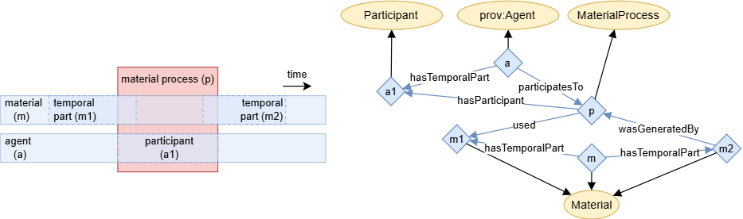

# The PINK Annotation Schema

The PINK Annotation Schema provides a semantic annotations for Safe and Sustainable by Design (SSbD) approach to guide the innovation process for chemicals and materials. It adhears to the recommendations specified by [DCAT-AP 3.0.1].

[DCAT-AP 3.0.1]: https://semiceu.github.io/DCAT-AP/releases/3.0.1/

## Repository Files

- `catalog-v001.xml`: XML catalog mapping ontology files to their IRIs for semantic web tools.
- `contributors.ttl`: Turtle file listing contributors to the PINK Annotation Schema for this repository.
- `pink_annotation_schema.ttl`: Main ontology file for the PINK Annotation Schema.
- `reused-terms.ttl`: Terms from standard vocabularies reused by the schema.
- `LICENSE`: Creative Commons Attribution 4.0 International license

## Taxonomy

The taxonomy below shows a basic categorisation of the main concepts (OWL classes) in PINK Annotation Schema.
All concepts are further described in the PINK Annotation Schema itself.
This taxonomy is intentionally weekly axiomated in order to make it easy to align it to different popular top-level ontologies, like EMMO, DOLCE and BFO.

## Provenance

Unfortunately there exists no commonly adapted way to model provenance, as pointed out by [DCAT-AP][dcatap-provenance].
Therefore PINK suggests its own powerful, but still reasonable simple traceability and provenance model.

The basic building block is a process with its input and output.

As shown in the taxonomy, this general process can be sub-categorised according to its input and output:

Traceability can be achieved by connecting a series (or network) of these basic building blocks.
<!-- When two or more intentionally planned processes are connected this way, we call it a *workflow*. -->
By providing additional knowledge to the various process steps we get *provenance*.
The figure below shows an example of a very simple provenance graph, that combines three processes with some additional annotations.

### Parthood and causality

An important aspect of provenance is to keep track on how a sample e.g. is cut into several specimens and how the specimens later may be joined in new configurations. 
Likewise is also how a material is changed during a process a part of a process. 

[dcatap-provenance]: https://interoperable-europe.ec.europa.eu/collection/semic-support-centre/solution/dcat-application-profile-implementation-guidelines/release-5
