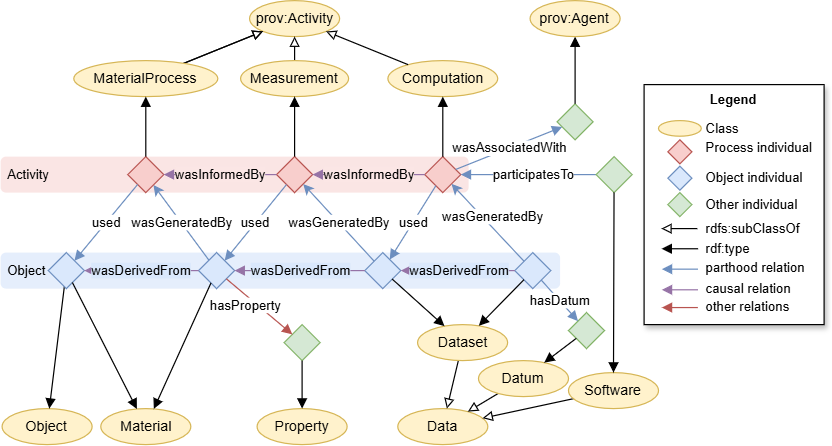

# The PINK Annotation Schema
The PINK Annotation Schema provides semantic annotations for the Safe and Sustainable by Design (SSbD) approach to guide the innovation process for chemicals and materials.
It adhears to the recommendations specified by [DCAT-AP 3.0.1] as implemented in tripper, 
and builds on [PROV-O] for provenance.
It is constructed to be easily aligned with EMMO.

## Repository Files
- `catalog-v001.xml`: XML catalog mapping ontology files to their IRIs for semantic web tools.
- `contributors.ttl`: Turtle file listing contributors to the PINK Annotation Schema for this repository.
- `pink_annotation_schema.ttl`: Main ontology file for the PINK Annotation Schema.
- `reused-terms.ttl`: Terms from standard vocabularies reused by the schema.
- `LICENSE`: Creative Commons Attribution 4.0 International license.
- `docs/`: Sub-directory with documentation.

## Taxonomy
The taxonomy below shows a basic categorisation of the main concepts (OWL classes) in the PINK Annotation Schema.
It unifies concepts from common vocabularies, like [Dublin Core], [DCAT], [PROV-O] and [FOAF].
This gives the adapted terms additional context.
However, the taxonomy is intentionally weekly axiomated in order to facilitate alignment to different popular top-level ontologies, like EMMO, DOLCE and BFO.

At the top-level, the PINK Annotation Schema has four root concepts:

- **`prov:Entity`**: A physical, digital, conceptual, or other kind of thing with some fixed aspects.
  [PROV-O] lacks the accuracy of nominalism and allows both real and imaginary entities.

- **`prov:Activity`**: Something that occurs over a period of time and acts upon or with entities.
  Hence, its individuals have some temporal parts (that are not of the same type as the activity itself).
  An activity may include consuming, processing, transforming, modifying, relocating, using, or generating entities.

- **`:Role`**: The class of all individuals that are defined through a parthood relation to an entity.
  The individual can be said to have a *role* in relation to the entity.

- **`foaf:Agent`**: A thing that does stuff (like person, group, software or physical artifact).
  The [FOAF] specification of a *agent* is very loose.
  The subclass `prov:Agent` provides further context, by saying that a `prov:agent` bears some form of responsibility for an activity, the existence of an entity or the activity of another agent. 

See the PINK Annotation Schema itself, for a description of all the other concepts.

> [!NOTE]
> Should we make `foaf:Agent` and `:Role` subclasses of `prov:Entity`?
>
> Logically it make sense and will simplify the taxonomy, making it more aligned with top-level ontologies like DOLCE and BFO and not break alignment with EMMO.
> However, it implies that `prov:Agent` is a `prov:Entity`, which is no contradiction, but is a statement that is not expressed in [PROV-O].

## Provenance
The provenance description in PINK is based on [PROV-O].

For more accurate descriptions of complex workflows involving spatial and temporal parts, PINK suggests an enhanced formalism.

A textual description of the provenance can be provided with `dcterms:provenance`.
However, for a semantic provenance description [PROV-O] should be used (since `dcterms:provenance` has no agreed semantics as discussed by [DCAT-AP][dcatap-provenance]).

The basic building block of a provenance description is a `prov:Activity` with `prov:Entity` as input and output:

As shown in the taxonomy, this general process can be sub-categorised according to its input and output:

Traceability can be achieved by connecting a series (or network) of these basic building blocks.
<!-- When two or more intentionally planned processes are connected this way, we call it a *workflow*. -->
By providing additional knowledge to the various process steps we get *provenance*.
The figure below shows an example of a simple provenance graph, that combines three processes with some additional annotations.

Given the network of `prov:used` and `prov:wasInformedBy` relations, can the `prov:wasInformedBy` and `prov:wasDerivedFrom` relations be inferred by a reasoner (based on [SWRL] rules).

### Complex workflows with spatial and temporal parts
An important aspect of provenance is to keep track on how a sample e.g. is cut into several specimens and how the specimens later may be joined in new configurations.
Likewise is also how a material is changed during a process a part of a process.

The figure below shows a material process (`p`) that changes a material (`m`).
The input and output of the material process are the temporal parts (`m1` and `m2`) of the material, respectively.
The material process is driven by an agent (`a`), who's temporal part (`a1`) is a participant (i.e. has an active role) in the process.

### Enhanced parthood and causal formalism
To formally correct describing workflows like the above material process, the PINK Annotation Schema include formalised categorisations of parthood and causal relations, shown in the figures below.
These categorisations incorporates parthood and causal relations from [Dublin Core] and [PROV-O] and gives them an enhanced semantic meaning.

[DCAT-AP 3.0.1]: https://semiceu.github.io/DCAT-AP/releases/3.0.1/
[DCAT]: https://www.w3.org/TR/vocab-dcat-3/
[FOAF]: http://xmlns.com/foaf/spec/
[PROV-O]: https://www.w3.org/TR/prov-o/
[Dublin Core]: https://www.dublincore.org/specifications/dublin-core/dcmi-terms/
[dcatap-provenance]: https://interoperable-europe.ec.europa.eu/collection/semic-support-centre/solution/dcat-application-profile-implementation-guidelines/release-5
[SWRL]: https://www.w3.org/submissions/SWRL/
