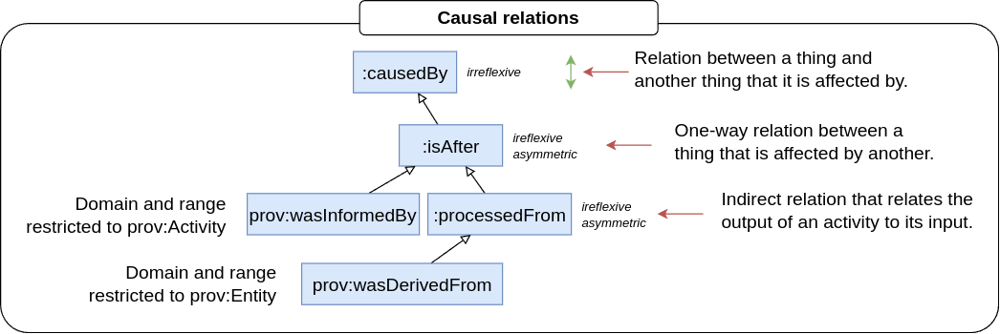

# The PINK Annotation Schema
The PINK Annotation Schema provides semantic annotations for the Safe and Sustainable by Design (SSbD) approach to guide the innovation process for chemicals and materials.
It adhears to the recommendations specified by [DCAT-AP 3.0.1] as implemented in [Tripper],
and builds on [PROV-O] for provenance.
It is constructed to be easily aligned with [EMMO].

> [!WARNING]
> The PINK Annotation Schema is still under early and heavy development and may change without notice.
> It is not intended for production at the current stage.

## Repository Files
- `catalog-v001.xml`: XML catalog mapping ontology files to their IRIs for semantic web tools.
- `contributors.ttl`: Turtle file listing contributors to the PINK Annotation Schema for this repository.
- `pink_annotation_schema.ttl`: Main ontology file for the PINK Annotation Schema.
- `reused-terms.ttl`: Terms from standard vocabularies reused by the schema.
- `LICENSE`: Creative Commons Attribution 4.0 International license.
- `docs/`: Sub-directory with documentation.

## Extra PINK annotations of externally defined terms
The PINK Annotation Schema never changes the semantics of existing terms defined externally (e.g. by W3C or DCAT-AP).
However, the PINK Annotation Schema can:
- Make the documentation of externally defined terms explicit in the Knowledge Base (KB) without importing the whole vocabularies.
- Add PINK-specific usage notes (using `pink:usageNote`, not `vann:usageNote`).
- Add a `ddoc:conformance` relation that specifies whether the relation is "mandatory", "recommended" or "optional" in PINK.
  PINK will never change the conformance described in the DCAT-AP documentation to something weaker.

The basic rule for such additions is that they can live hand-in-hand with similar annotations by other projects without creating confusion or inconsistencies.

For any other additional specifications of an existing term, a PINK-specific subclass or subproperty will be created.
Such subclasses/subproperties will normally keep the W3C name, but with the `pink` namespace (or the `ddoc` namespace if the concept is specific for the tripper data documentation).

## Taxonomy
The taxonomy below shows a basic categorisation of the main concepts (OWL classes) in the PINK Annotation Schema.
It unifies concepts from common vocabularies, like [Dublin Core], [DCAT], [PROV-O] and [FOAF].
This gives the adapted terms additional context.
However, the taxonomy is intentionally weekly axiomated in order to facilitate alignment to different popular top-level ontologies, like [EMMO], [DOLCE] and [BFO].

At the top-level, the PINK Annotation Schema has four root concepts:

- **`prov:Entity`**: A physical, digital, conceptual, or other kind of thing with some fixed aspects.
  [PROV-O] lacks the accuracy of nominalism and allows both real and imaginary entities.

- **`prov:Activity`**: Something that occurs over a period of time and acts upon or with entities.
  Hence, its individuals have some temporal parts (that are not of the same type as the activity itself).
  An activity may include consuming, processing, transforming, modifying, relocating, using, or generating entities.

- **`:Role`**: The class of all individuals that are defined through a parthood relation to an entity.
  The individual can be said to have a *role* in relation to the entity.

- **`foaf:Agent`**: A thing that does stuff (like person, group, software or physical artifact).
  The [FOAF] specification of a *agent* is very loose.
  The subclass `prov:Agent` provides further context, by saying that a `prov:agent` bears some form of responsibility for an activity, the existence of an entity or the activity of another agent.

See the [PINK classes] table and the PINK Annotation Schema itself, for a description of all the other concepts.

## Provenance
The provenance description in PINK is based on [PROV-O].

For more accurate descriptions of complex workflows involving spatial and temporal parts, PINK suggests an enhanced formalism.

A textual description of the provenance can be provided with `dcterms:provenance`.
However, for a semantic provenance description [PROV-O] should be used (since `dcterms:provenance` has no agreed semantics as discussed by [DCAT-AP][dcatap-provenance]).

The basic building block of a provenance description is a `prov:Activity` with `prov:Entity` as input and output:

As shown in the taxonomy, this general process can be sub-categorised according to its input and output:

Traceability can be achieved by connecting a series (or network) of these basic building blocks.
<!-- When two or more intentionally planned processes are connected this way, we call it a *workflow*. -->
By providing additional knowledge to the various process steps we get *provenance*.
The figure below shows an example of a simple provenance graph, that combines three processes with some additional annotations.

Concepts belonging to the PINK namespace in the figure above have been written in cursive.

Given the network of `:used` and `:wasInformedBy` relations, it is possible to infer `:wasInformedBy` and `:wasDerivedFrom` relations.
This is done by the reasoner (using [SWRL] rules that are added in the pink_annotation_schema.ttl).

### Complex workflows with spatial and temporal parts
An important aspect of provenance is to keep track on how a sample e.g. is cut into several specimens and how the specimens later may be joined in new configurations.
Likewise, how a material is changed during a process or part of a process.

The figure below shows a material process (`p`) that changes a material (`m`).
The input and output of the material process are the temporal parts (`m1` and `m2`) of the material, respectively.
The material process is driven by an agent (`a`), who's temporal part (`a1`) is a participant (i.e. has an active role) in the process.

### Enhanced parthood and causal formalism
To formally describe workflows correctly, such as the above material process, the PINK Annotation Schema includes formalised categorisations of parthood and causal relations, shown in the figures below.
These categorisations incorporate parthood and causal relations from [Dublin Core] and [PROV-O] and give them enhanced semantic meaning.

> [!NOTE]
> Parthood relation chracteristics are explained in the [Protégé documentation](https://protegeproject.github.io/protege/views/object-property-characteristics/).
>
> Antisymmetric is a weaker form of asymmetric: if `x -> y`, then `y -> x` if and only if `x = y`.
> This is not the case for asymmetric relations, since they exclude the equality `x = y`.

## General description of activities
Provenance is about what has happened. [PROV-O] is intended to provenance information.
In PINK we also want to describe what can happen.

For instance, we want to express what kind of input and output a given type of computation takes and what software that is executed to run the computation.
This is done by documenting the computation at the class level (TBox-level) using the following restrictions (in Manchester syntax):

    Class: app:MyComputation
        subClassOf: pink:Computation
        subClassOf: pink:hasInput some app:MyInput
        subClassOf: pink:hasOutput some app:MyOutput
        subClassOf: pink:hasSoftware some app:MySoftware

where `app` is the prefix of the application ontology defining the computation, its input/output and software.

> [!NOTE]
> The `pink:hasSoftware` property is a subproperty of the inverse of `pink:participatesTo`.

PINK provides tooling (based on [Tripper]) to help providing class-level documentation.
This is done the normal way using spreadsheets, but with the `@type` keyword replaced by `subClassOf`.
For example, the above declaration of a computation could provided as follows:

| @id               | subClassOf       | hasInput    | hasOutput    | hasSoftware    |
|-------------------|------------------|-------------|--------------|----------------|
| app:MyComputation | pink:Computation | app:MyInput | app:MyOutput | app:MySoftware |

[PINK classes]: ./docs/classes.md
[DCAT-AP 3.0.1]: https://semiceu.github.io/DCAT-AP/releases/3.0.1/
[DCAT]: https://www.w3.org/TR/vocab-dcat-3/
[FOAF]: http://xmlns.com/foaf/spec/
[PROV-O]: https://www.w3.org/TR/prov-o/
[Dublin Core]: https://www.dublincore.org/specifications/dublin-core/dcmi-terms/
[dcatap-provenance]: https://interoperable-europe.ec.europa.eu/collection/semic-support-centre/solution/dcat-application-profile-implementation-guidelines/release-5
[SWRL]: https://www.w3.org/submissions/SWRL/
[EMMO]: https://emmc.eu/emmo/
[DOLCE]:https://www.loa.istc.cnr.it/dolce/overview.html
[BFO]: https://basic-formal-ontology.org/
[Tripper]: https://emmc-asbl.github.io/tripper/latest/
