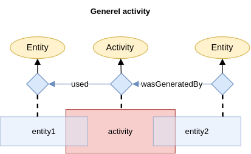
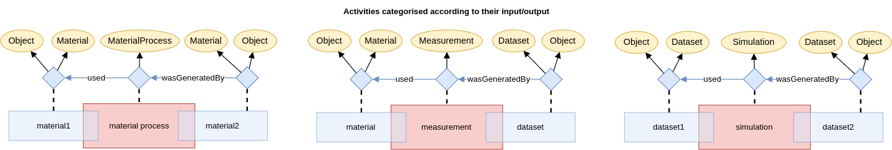

# Background

## Provenance
The provenance description in PINK is based on [PROV-O].

For more accurate descriptions of complex workflows involving spatial and temporal parts, PINK suggests an enhanced formalism.

A textual description of the provenance can be provided with `dcterms:provenance`.
However, for a semantic provenance description [PROV-O] should be used (since `dcterms:provenance` has no agreed semantics as discussed by [DCAT-AP][dcatap-provenance]).

The basic building block of a provenance description is a `prov:Activity` with `prov:Entity` as input and output:

As shown in the taxonomy, this general process can be sub-categorised according to its input and output:

Traceability can be achieved by connecting a series (or network) of these basic building blocks.
<!-- When two or more intentionally planned processes are connected this way, we call it a *workflow*. -->
By providing additional knowledge to the various process steps we get *provenance*.
The figure below shows an example of a simple provenance graph, that combines three processes with some additional annotations.

### Complex workflows with spatial and temporal parts
An important aspect of provenance is to keep track on how a sample e.g. is cut into several specimens and how the specimens later may be joined in new configurations.
Likewise, how a material is changed during a process or part of a process.

The figure below shows a material process (`p`) that changes a material (`m`).
The input and output of the material process are the temporal parts (`m1` and `m2`) of the material, respectively.
The material process is driven by an agent (`a`), who's temporal part (`a1`) is a participant (i.e. has an active role) in the process.

Concepts belonging to the PINK namespace in the figure above have been written in cursive.

Given the network of `:used` and `:wasInformedBy` relations, it is possible to infer `:wasInformedBy` and `:wasDerivedFrom` relations.
This is done by the reasoner (using [SWRL] rules that are added in [pink_annotation_schema.ttl]).

## Taxonomy
The taxonomy below shows a basic categorisation of the main concepts (OWL classes) in the PINK Annotation Schema.
It unifies concepts from common vocabularies, like [Dublin Core], [PROV-O], [DCAT] and [FOAF].
This gives the adapted terms additional context.
However, the taxonomy is intentionally weekly axiomated in order to facilitate alignment to different popular top-level ontologies, like [EMMO], [DOLCE] and [BFO].

At the top-level, the PINK Annotation Schema has the three root concepts from [PROV-O]:

- **`prov:Entity`**: A physical, digital, conceptual, or other kind of thing with some fixed aspects.
  [PROV-O] lacks the accuracy of nominalism and allows both real and imaginary entities.

- **`prov:Activity`**: Something that occurs over a period of time and acts upon or with entities.
  Hence, its individuals have some temporal parts (that are not of the same type as the activity itself).
  An activity may include consuming, processing, transforming, modifying, relocating, using, or generating entities.

- **`foaf:Agent`**: A thing that does stuff (like person, group, software or physical artifact).
  The [FOAF] specification of a *agent* is very loose.
  The subclass `prov:Agent` provides further context, by saying that a `prov:agent` bears some form of responsibility for an activity, the existence of an entity or the activity of another agent.

See the [reference documentation], for a description of all the other concepts.

## Relations
The PINK Annotation Schema includes three types of relations: parthood relations, causal relations and semiotic relations.

The The PINK Annotation Schema incorporate parthood and causal relations from [PROV-O] and  [Dublin Core] and give them enhanced semantic meaning.
This is based on the mereocausal theory by [Zaccarini *et. al.*], but is simplified and adapted to the needs of PINK.

For improved semantic expressiveness and to support logical validation, the PINK Annotation Schema adds characteristics to the standard [PROV-O] object properties.
According to the [guiding principles], the characteristics is added to PINK-specific subproperties of the [PROV-O] object properties.
Such semantically enhanced subclass relations of corresponding [PROV-O] and [Dublin Core] relations are written in *cursive* in the figure above.

> [!TIP]
> Object property chracteristics is explained in the [Protégé documentation](https://protegeproject.github.io/protege/views/object-property-characteristics/).
>
> Antisymmetric (not included in OWL) is a weaker form of asymmetric: if `x -> y`, then `y -> x` if and only if `x = y`.
> This is not the case for asymmetric relations, since they exclude the equality `x = y`.

### Parthood relations

The above figure includes graphical illustrations of the parthood relations.
The colour scheme in these illustrations represents activities in red, entities in blue, agents in green and unspecified nature (activity/entity/agent) in gray.
The arrow illustrates the direction of the relation.

### Causal relations
Causal relations focuses on whether an individual is influenced by another.
In [PROV-O] this is described by the fundamental relation `prov:wasInfluencedBy`.
In PINK we introduce the toplevel subclass `:causedBy` as a subclass of `prov:wasInfluencedBy`.
The causal relations currently included in the PINK Annotation Schema are shown in the figure below.
Most of these relations are indirect causations mediated by an activity.
These chains of causations have been expressed using [SWRL] rules.
The relations starting with ":was" are subclasses of the corresponding relations in [PROV-O].
The `:attributed` and `:wasAttributedTo` are the inverse of each other.

### Semiotic relations
Semiotic relations take part in a triadic [semiotic] meaning-making process, where an 'interpreter' connects a 'sign' (e.g. a property) to an entity (called 'referent').
The semiotic relations in the PINK Annotation Scheme are inspirred by EMMO, which in turn is based on the semiotic theory by Charles Sanders Peirce (1839-1914).
Semiotic relations can be seen as shortcuts that replaces a series of complex causal interactions with a single relation.

An important use of semiotics is to support the scientific view that a property is not an intrinsic quality of an entity, but something that is measured or determined by an interpreter.

For example, to determine the toxicity of a chemical substance you have to measure (or calculate or estimate) it. And the result depends on how it is measured/calculated/estimated.

## Class-level documentation
Provenance is about what has happened. [PROV-O] is intended to describe provenance information.
In PINK we also want to describe general workflows before they are executed.
That is, to describe something that can happen.

Since we don't know whether the workflow actually will be executed, we can't create individuals for it.
Hence, what can happen must be described at class level (TBox-level).
Thus, specific subclasses of prov:Activity are made.

In Manchester syntax, this may be expressed as follows

    Class: uob:SpecificToxicityComputation
        subClassOf: pink:Computation
        subClassOf: pink:hasInput some uob:ToxicityComputationInput
        subClassOf: pink:hasOutput some uob:ToxicityComputationOutput
        subClassOf: pink:hasSoftware some uob:ToxicitySoftware

where `uob` is the prefix of the application ontology defining the computation.

PINK provides tooling (based on [Tripper]) to help providing class-level documentation.
This is done the normal way using spreadsheets, but with the `@type` keyword replaced by `subClassOf` (`@type` is implicit and would always be `owl:Class`).
For example, the above declaration of a computation could provided as follows:

| @id                             | @type     | subClassOf        | description | hasSoftware          | hasInput                     | hasOutput                     |
|---------------------------------|-----------|-------------------|-------------|----------------------|------------------------------|-------------------------------|
| uob:SpecificToxicityComputation | owl:Class | pink:Computiation | ...         | uob:ToxicitySoftware | uob:ToxicityComputationInput | uob:ToxicityComputationOutput |

where the entries under `hasInput` and `hasOutput` refer to dataset subclasses.
These dataset classes can be documented in a similar way.

| @id                           | @type     | subClassOf   | description | ... |
|-------------------------------|-----------|--------------|-------------|-----|
| uob:ToxicityComputationInput  | owl:Class | pink:Dataset | ...         | ... |
| uob:ToxicityComputationOutput | owl:Class | pink:Dataset | ...         | ... |

[reference documentation]: https://pink-project.github.io/PINK-annotation-schema/widoco/index-en.html
[Guiding principles]: ./guiding-principles.md
[PINK Annotation Schema]: https://pink-project.github.io/PINK-annotation-schema/widoco/index-en.html
[reused terms]: https://pink-project.github.io/PINK-annotation-schema/widoco-reused-terms/index-en.html

[Zaccarini *et. al.*]: https://ebooks.iospress.nl/doi/10.3233/FAIA231120
[semiotic]: https://plato.stanford.edu/entries/peirce-semiotics/

[Guiding principles]: ./guiding-principles.md
[DCAT-AP 3.0.1]: https://semiceu.github.io/DCAT-AP/releases/3.0.1/
[DCAT]: https://www.w3.org/TR/vocab-dcat-3/
[FOAF]: http://xmlns.com/foaf/spec/
[PROV-O]: https://www.w3.org/TR/prov-o/
[Dublin Core]: https://www.dublincore.org/specifications/dublin-core/dcmi-terms/
[dcatap-provenance]: https://interoperable-europe.ec.europa.eu/collection/semic-support-centre/solution/dcat-application-profile-implementation-guidelines/release-5
[SWRL]: https://www.w3.org/submissions/SWRL/
[EMMO]: https://emmc.eu/emmo/
[DOLCE]:https://www.loa.istc.cnr.it/dolce/overview.html
[BFO]: https://basic-formal-ontology.org/
